基于SpringBoot的智慧生活商城系统（程序+论文）
=
- 完整代码获取地址：从戎源码网 ([https://armycodes.com/](https://armycodes.com/))
- 作者微信：19941326836  QQ：952045282 
- 承接计算机毕业设计、Java毕业设计、Python毕业设计、深度学习、机器学习
- 选题+开题报告+任务书+程序定制+安装调试+论文+答辩ppt 一条龙服务
- 所有选题地址https://github.com/nature924/allProject

一、项目介绍
---
基于Spring Boot框架实现的智慧生活商城系统，系统包含两种角色：管理员、用户,系统分为前台和后台两大模块，主要功能如下。
### 前台：
1. 首页：展示商城的基本信息和推荐商品等内容。
2. 公告：展示商城发布的公告通知。
3. 商品：展示商城的商品信息。
4. 个人中心：用户可以管理个人信息。
5. 购物车：用户可以将商品加入购物车。

### 后台：
### 用户：
1. 个人中心：用户可以管理个人信息，包括修改个人资料。
2. 公告管理：用户可以查看商城发布的公告通知。

### 管理员：
1. 个人中心：管理员可以管理个人信息，包括修改个人资料。
2. 基础数据管理：管理员可以管理系统的基础数据。
3. 公告管理：管理员可以发布、编辑、删除商城的公告通知。
4. 商品管理：管理员可以管理商品信息。
5. 用户管理：管理员可以管理用户信息。
6. 轮播图信息：管理员可以管理商城首页的轮播图信息。

二、项目技术
---
- 编程语言：Java
- 数据库：MySQL
- 项目管理工具：Maven
- 前端技术：VUE、HTML、Jquery、Bootstrap
- 后端技术：Spring、SpringMVC、MyBatis

三、运行环境
---
- 操作系统：Windows、macOS都可以
- JDK版本：JDK1.8以上都可以
- 开发工具：IDEA、Ecplise、Myecplise都可以
- 数据库: MySQL5.7以上都可以
- Tomcat：任意版本都可以
- Maven：任意版本都可以

四、运行截图
---
### 论文截图：
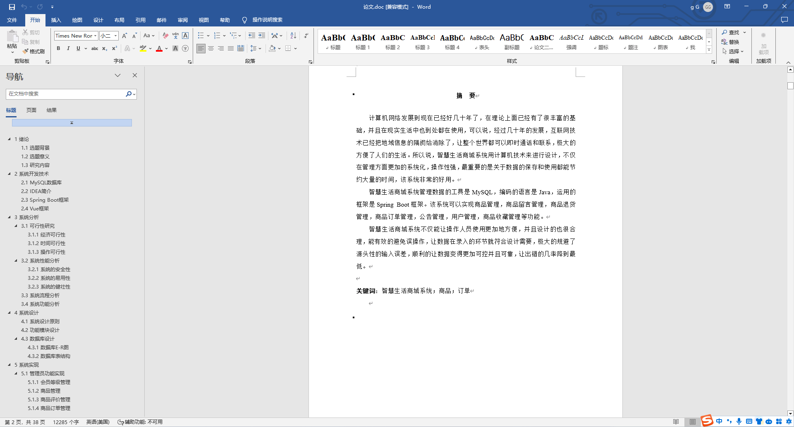
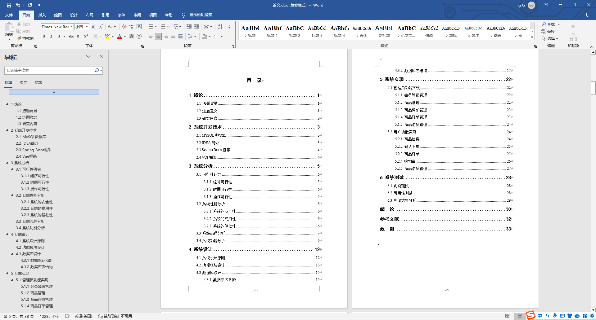

### 程序截图：
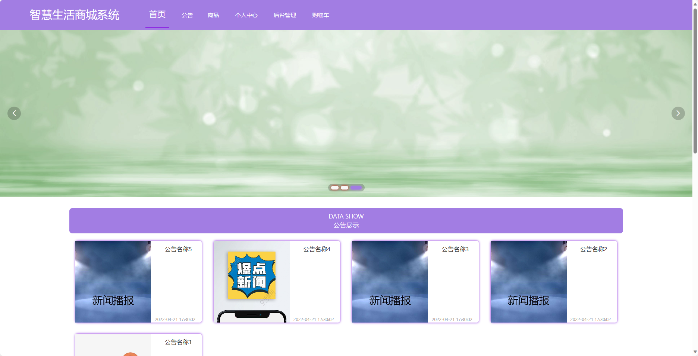
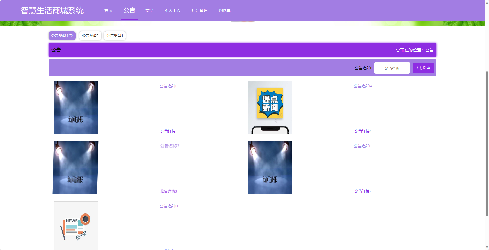
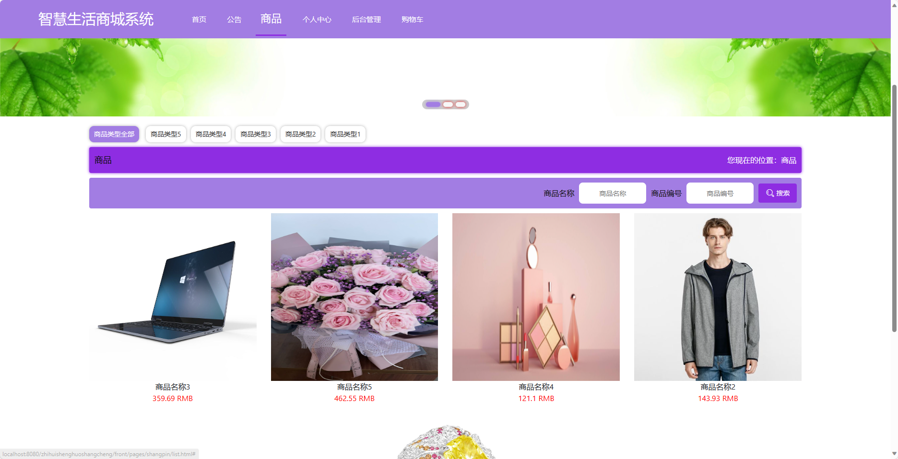
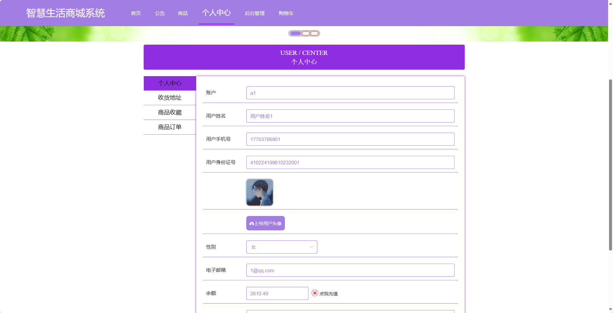

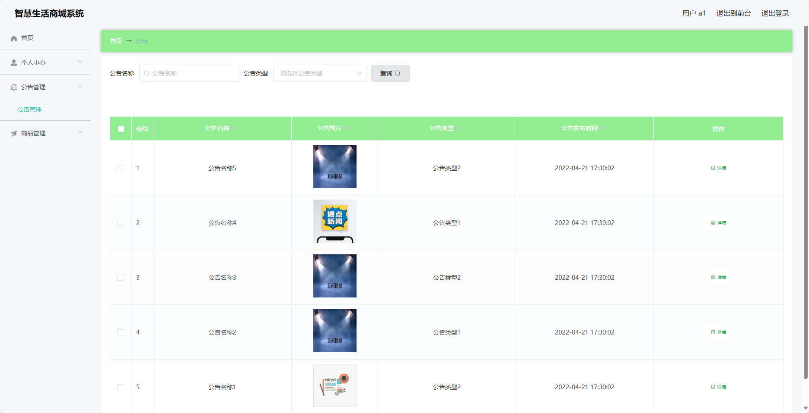
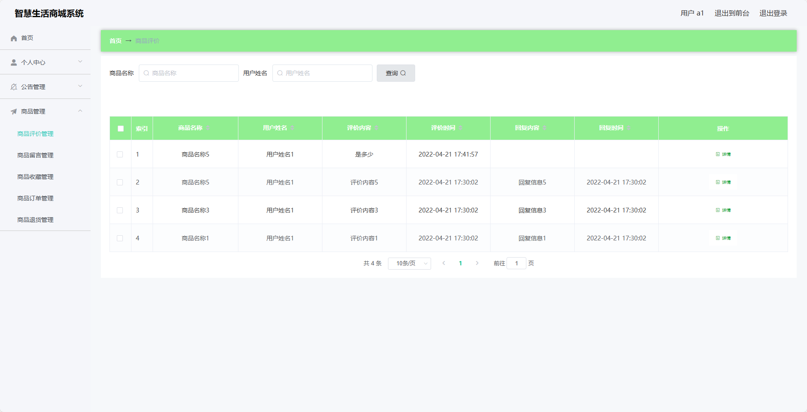
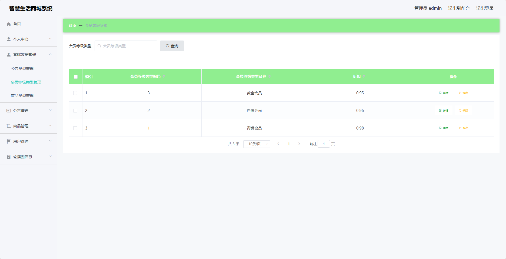
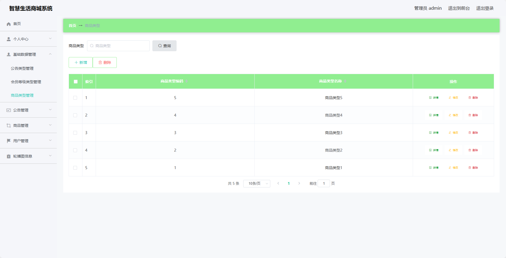
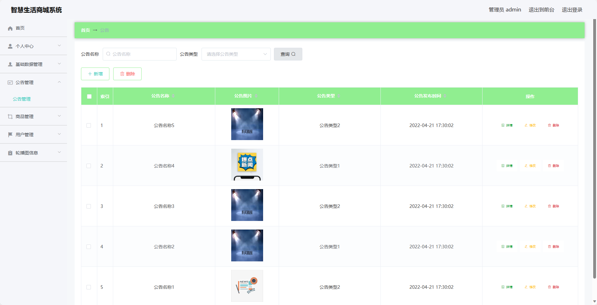

